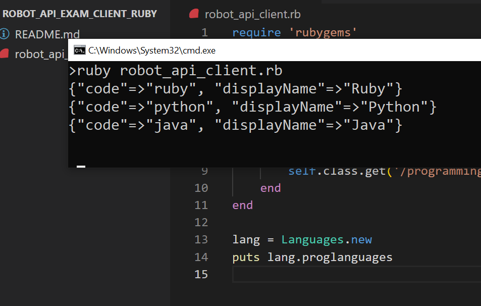

## Another way to interact with the server using Ruby
- Install :
```python
gem install httparty
```

- Navigate in this folder
- Then run the command below :
```
ruby robot_api_client.rb
```
<br>
Screenshot

